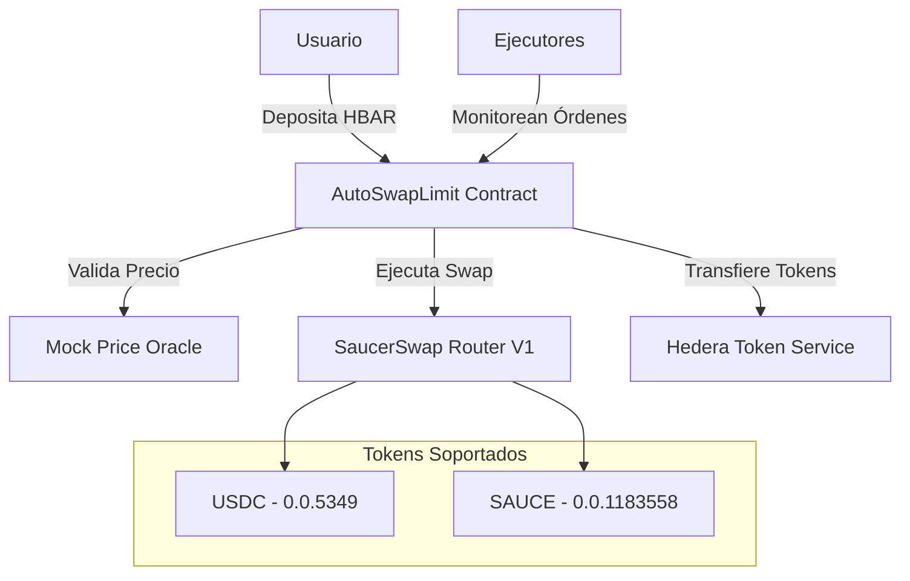

# AutoSwapLimit - Hedera Automated Limit Orders

[](https://hedera.com)
[](https://soliditylang.org/)
[](https://saucerswap.finance)
[](https://opensource.org/licenses/MIT)

**AutoSwapLimit** es un protocolo de automatización de órdenes límite construido sobre **Hedera Hashgraph** que permite a los usuarios crear órdenes de intercambio automatizadas que se ejecutan cuando se alcanzan precios objetivo específicos usando **SaucerSwap**.

## 🌟 Características Principales

- 🎯 **Órdenes Límite Automatizadas**: Configura intercambios que se ejecutan automáticamente al alcanzar precios objetivo
- ⚡ **Integración Nativa Hedera**: Utiliza HIP-206 (Hedera Token Service) para gestión eficiente de tokens
- 🔄 **SaucerSwap Integration**: Conectado con SaucerSwap Router V1 para liquidez optimizada
- 🛡️ **Ejecución Segura**: Sistema de ejecutores autorizados con tarifas competitivas
- 📊 **Oracle de Precios**: Mock oracle integrado para testing y desarrollo
- 🔐 **Sin Custodia**: Los usuarios mantienen control total de sus fondos hasta la ejecución

## 🏗️ Arquitectura del Sistema



## 📦 Instalación

### Prerequisitos

- Node.js 18+
- npm o yarn
- Cuenta Hedera Testnet con HBAR

### Configuración del Proyecto

```bash
# Clonar el repositorio
git clone <repository-url>
cd AutomationSwapLimit

# Instalar dependencias
npm install

# Configurar variables de entorno
cp .env.example .env
```

### Variables de Entorno

Crea un archivo `.env` con:

```bash
# Hedera Account Configuration
HEDERA_ACCOUNT_ID=0.0.YOUR_ACCOUNT_ID
PRIVATE_KEY=your_private_key_here

# Network Configuration
TESTNET_RPC_URL=https://testnet.hashio.io/api
TESTNET_CHAIN_ID=296
MAINNET_RPC_URL=https://mainnet.hashio.io/api
MAINNET_CHAIN_ID=295
```

## 🚀 Uso

### Compilación

```bash
npm run compile
```

### Despliegue

```bash
# Desplegar en Hedera Testnet usando SDK nativo
npm run deploy:nativo
```

### Testing

```bash
# Ejecutar todos los tests
npm test

# Test específico de flujo de swap
npm run test:swap-flow

# Test de ejecución en Hedera
npm run test:hedera
```

## 🔧 Contratos Principales

### AutoSwapLimit.sol

Contrato principal que gestiona las órdenes límite automatizadas.

**Funciones Principales:**

```solidity
// Crear nueva orden límite
function createSwapOrder(
    address tokenOut,      // Token a recibir
    uint256 minAmountOut,  // Cantidad mínima esperada
    uint256 triggerPrice,  // Precio que activa la orden
    uint256 expirationTime // Tiempo de expiración
) external payable

// Ejecutar orden (ejecutores autorizados)
function executeSwapOrder(uint256 orderId, uint256 currentPrice) external

// Cancelar orden (solo propietario)
function cancelSwapOrder(uint256 orderId) external
```

### MockPriceOracle.sol

Oracle de precios para testing con feeds configurables.

**Tokens Soportados:**
- **USDC**: $1.00 USD (referencia)
- **HBAR/WHBAR**: $0.27 USD
- **SAUCE**: $0.0587 USD

### HederaTokenService.sol

Wrapper para HIP-206 que maneja asociación automática de tokens.

## 📊 Configuración de Tokens

### Tokens Testnet Soportados

| Token | Dirección | Hedera ID | Path |
|-------|-----------|-----------|------|
| USDC | `0x00000000000000000000000000000000000014F5` | 0.0.5349 | WHBAR → USDC |
| SAUCE | `0x0000000000000000000000000000000000120f46` | 0.0.1183558 | WHBAR → USDC → SAUCE |

### Límites del Sistema

- **Monto Mínimo**: 0.01 HBAR
- **Monto Máximo**: 180 HBAR (Router V1)
- **Tarifa de Ejecución**: 0.1 HBAR
- **Tiempo Máximo de Expiración**: 30 días

## 🛠️ Scripts Útiles

```bash
# Crear orden fresca para testing
npm run create-fresh-order

# Probar asociación de tokens
npm run test-token-association

# Testing de ejecución pública
npm run test-public-execution

# Limpiar compilación
npm run clean

# Build completo
npm run build
```

## 🔐 Seguridad

### Características de Seguridad

- ✅ **ReentrancyGuard**: Protección contra ataques de reentrada
- ✅ **Ownable**: Control de acceso para funciones administrativas
- ✅ **Validación de Precios**: Oracle independiente para verificación
- ✅ **Límites de Tiempo**: Expiración automática de órdenes
- ✅ **Validación de Tokens**: Solo tokens pre-aprobados

### Ejecutores Autorizados

El sistema soporta tres tipos de ejecutores:

1. **Backend Executor**: Executor principal del sistema
2. **Ejecutores Autorizados**: Lista de direcciones aprobadas por el owner
3. **Ejecución Pública**: Cualquier usuario puede ejecutar órdenes (configurable)

## 📈 Flujo de Usuario

### 1. Crear Orden

```typescript
// Enviar HBAR y crear orden límite
const tx = await autoSwapLimit.createSwapOrder(
    usdcAddress,           // Quiero recibir USDC
    expectedAmount,        // Cantidad mínima
    triggerPrice,          // Precio objetivo
    expirationTime,        // Válida por 24 horas
    { value: hbarAmount }  // HBAR + tarifa ejecución
);
```

### 2. Monitoreo

Las órdenes son monitoreadas automáticamente por:
- Backend executor del sistema
- Ejecutores autorizados
- Usuarios públicos (si está habilitado)

### 3. Ejecución

Cuando el precio objetivo se alcanza:
```typescript
// El ejecutor llama a esta función
await autoSwapLimit.executeSwapOrder(orderId, currentPrice);
```

### 4. Recepción de Tokens

Los tokens se transfieren automáticamente al usuario usando HTS.

## 🧪 Testing

### Test Suite

- **AutoSwapLimit.swapFlow.test.ts**: Test completo del flujo de swap
- **Deployment Tests**: Verificación de despliegue correcto
- **Token Association Tests**: Validación de HIP-206
- **Execution Tests**: Pruebas de ejecución de órdenes

### Ejecutar Tests

```bash
# Test local
npm test

# Test en Hedera Testnet
npm run test:hedera

# Test específico
npx hardhat test test/AutoSwapLimit.swapFlow.test.ts --network hederaTestnet
```

## 🌐 Direcciones de Contrato

### Testnet

- **SaucerSwap Router V1**: `0x0000000000000000000000000000000000004B5C` (0.0.19264)
- **WHBAR**: `0x0000000000000000000000000000000000003aD2` (0.0.14802)

### Verificación

Los contratos desplegados son verificables en [HashScan](https://hashscan.io/testnet).

## 🤝 Contribución

1. Fork el proyecto
2. Crea una rama para tu feature (`git checkout -b feature/AmazingFeature`)
3. Commit tus cambios (`git commit -m 'Add some AmazingFeature'`)
4. Push a la rama (`git push origin feature/AmazingFeature`)
5. Abre un Pull Request

## 📝 Licencia

Este proyecto está bajo la Licencia MIT - ver el archivo [LICENSE](LICENSE) para detalles.

## 🔗 Links Útiles

- [Hedera Documentation](https://docs.hedera.com/)
- [SaucerSwap](https://saucerswap.finance/)
- [HIP-206 Specification](https://hips.hedera.com/hip/hip-206)
- [HashScan Explorer](https://hashscan.io/)

## 📞 Soporte

Para preguntas o soporte:

- Crear un issue en GitHub
- Documentación técnica en `/docs`
- Revisar `HIP-206-INTEGRATION.md` para detalles de integración

---

**⚠️ Disclaimer**: Este es un proyecto de desarrollo. Usar en testnet únicamente. No apto para mainnet sin auditoría de seguridad completa.