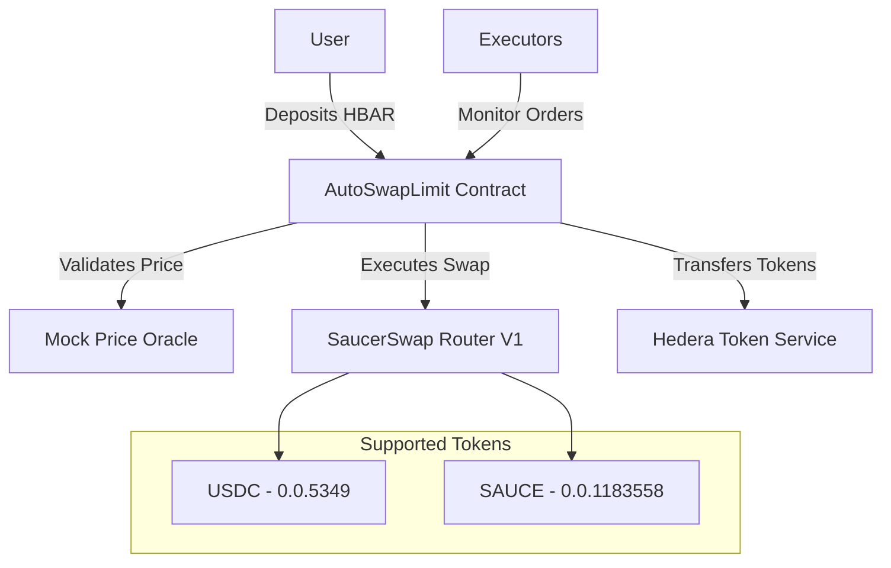

# AutoSwapLimit - Hedera Automated Limit Orders

[](https://hedera.com)
[](https://soliditylang.org/)
[](https://saucerswap.finance)
[](https://opensource.org/licenses/MIT)

**AutoSwapLimit** is an automated limit order protocol built on **Hedera Hashgraph** that allows users to create automated swap orders that execute when specific target prices are reached using **SaucerSwap**.

## 🌟 Key Features

- 🎯 **Automated Limit Orders**: Configure swaps that execute automatically when target prices are reached
- ⚡ **Native Hedera Integration**: Uses HIP-206 (Hedera Token Service) for efficient token management
- 🔄 **SaucerSwap Integration**: Connected with SaucerSwap Router V1 for optimized liquidity
- 🛡️ **Secure Execution**: Authorized executor system with competitive fees
- 📊 **Price Oracle**: Integrated mock oracle for testing and development
- 🔐 **Non-Custodial**: Users maintain full control of their funds until execution

## 🏗️ System Architecture



## 📦 Installation

### Prerequisites

- Node.js 18+
- npm or yarn
- Hedera Testnet account with HBAR

### Project Setup

```bash
# Clone the repository
git clone <repository-url>
cd AutomationSwapLimit

# Install dependencies
npm install

# Configure environment variables
cp .env.example .env
```

### Environment Variables

Create a `.env` file with:

```bash
# Hedera Account Configuration
HEDERA_ACCOUNT_ID=0.0.YOUR_ACCOUNT_ID
PRIVATE_KEY=your_private_key_here

# Network Configuration
TESTNET_RPC_URL=https://testnet.hashio.io/api
TESTNET_CHAIN_ID=296
MAINNET_RPC_URL=https://mainnet.hashio.io/api
MAINNET_CHAIN_ID=295
```

## 🚀 Usage

### Compilation

```bash
npm run compile
```

### Deployment

```bash
# Deploy to Hedera Testnet using native SDK
npm run deploy:nativo
```

### Testing

```bash
# Run all tests
npm test

# Specific swap flow test
npm run test:swap-flow

# Hedera execution test
npm run test:hedera
```

## 🔧 Main Contracts

### AutoSwapLimit.sol

Main contract that manages automated limit orders.

**Main Functions:**

```solidity
// Create new limit order
function createSwapOrder(
    address tokenOut,      // Token to receive
    uint256 minAmountOut,  // Minimum expected amount
    uint256 triggerPrice,  // Price that triggers the order
    uint256 expirationTime // Expiration time
) external payable

// Execute order (authorized executors)
function executeSwapOrder(uint256 orderId, uint256 currentPrice) external

// Cancel order (owner only)
function cancelSwapOrder(uint256 orderId) external
```

### MockPriceOracle.sol

Price oracle for testing with configurable feeds.

**Supported Tokens:**
- **USDC**: $1.00 USD (reference)
- **HBAR/WHBAR**: $0.27 USD
- **SAUCE**: $0.0587 USD

### HederaTokenService.sol

HIP-206 wrapper that handles automatic token association.

## 📊 Token Configuration

### Supported Testnet Tokens

| Token | Address | Hedera ID | Path |
|-------|---------|-----------|------|
| USDC | `0x00000000000000000000000000000000000014F5` | 0.0.5349 | WHBAR → USDC |
| SAUCE | `0x0000000000000000000000000000000000120f46` | 0.0.1183558 | WHBAR → USDC → SAUCE |

### System Limits

- **Minimum Amount**: 0.01 HBAR
- **Maximum Amount**: 180 HBAR (Router V1)
- **Execution Fee**: 0.1 HBAR
- **Maximum Expiration Time**: 30 days

## 🛠️ Useful Scripts

```bash
# Create fresh order for testing
npm run create-fresh-order

# Test token association
npm run test-token-association

# Public execution testing
npm run test-public-execution

# Clean compilation
npm run clean

# Complete build
npm run build
```

## 🔐 Security

### Security Features

- ✅ **ReentrancyGuard**: Protection against reentrancy attacks
- ✅ **Ownable**: Access control for administrative functions
- ✅ **Price Validation**: Independent oracle for verification
- ✅ **Time Limits**: Automatic order expiration
- ✅ **Token Validation**: Only pre-approved tokens

### Authorized Executors

The system supports three types of executors:

1. **Backend Executor**: Main system executor
2. **Authorized Executors**: List of addresses approved by the owner
3. **Public Execution**: Any user can execute orders (configurable)

## 📈 User Flow

### 1. Create Order

```typescript
// Send HBAR and create limit order
const tx = await autoSwapLimit.createSwapOrder(
    usdcAddress,           // I want to receive USDC
    expectedAmount,        // Minimum amount
    triggerPrice,          // Target price
    expirationTime,        // Valid for 24 hours
    { value: hbarAmount }  // HBAR + execution fee
);
```

### 2. Monitoring

Orders are automatically monitored by:
- System backend executor
- Authorized executors
- Public users (if enabled)

### 3. Execution

When the target price is reached:
```typescript
// The executor calls this function
await autoSwapLimit.executeSwapOrder(orderId, currentPrice);
```

### 4. Token Reception

Tokens are automatically transferred to the user using HTS.

## 🧪 Testing

### Test Suite

- **AutoSwapLimit.swapFlow.test.ts**: Complete swap flow test
- **Deployment Tests**: Correct deployment verification
- **Token Association Tests**: HIP-206 validation
- **Execution Tests**: Order execution tests

### Run Tests

```bash
# Local test
npm test

# Hedera Testnet test
npm run test:hedera

# Specific test
npx hardhat test test/AutoSwapLimit.swapFlow.test.ts --network hederaTestnet
```

## 🌐 Contract Addresses

### Testnet

- **SaucerSwap Router V1**: `0x0000000000000000000000000000000000004B5C` (0.0.19264)
- **WHBAR**: `0x0000000000000000000000000000000000003aD2` (0.0.14802)

### Verification

Deployed contracts are verifiable on [HashScan](https://hashscan.io/testnet).

## 🤝 Contributing

1. Fork the project
2. Create a feature branch (`git checkout -b feature/AmazingFeature`)
3. Commit your changes (`git commit -m 'Add some AmazingFeature'`)
4. Push to the branch (`git push origin feature/AmazingFeature`)
5. Open a Pull Request

## 📝 License

This project is under the MIT License - see the [LICENSE](LICENSE) file for details.

## 🔗 Useful Links

- [Hedera Documentation](https://docs.hedera.com/)
- [SaucerSwap](https://saucerswap.finance/)
- [HIP-206 Specification](https://hips.hedera.com/hip/hip-206)
- [HashScan Explorer](https://hashscan.io/)

## 📞 Support

For questions or support:

- Create an issue on GitHub
- Technical documentation in `/docs`
- Review `HIP-206-INTEGRATION.md` for integration details

---

**⚠️ Disclaimer**: This is a development project. Use on testnet only. Not suitable for mainnet without complete security audit.